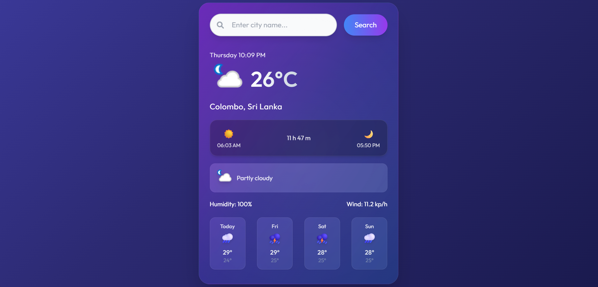

# 🌤 Weather Dashboard

A sleek, responsive, and dynamic weather application built with **HTML**, **Tailwind CSS**, and **Vanilla JavaScript**. This dashboard allows users to retrieve **current weather** and a **3-day forecast** for any city worldwide, powered by **WeatherAPI**.

---
<br>
  
  

  <br>

## 🚀 Features

- **Real-time Weather**  
  Displays current temperature, weather condition, humidity, and wind speed.

- **Search Functionality**  
  Search any city across the globe.

- **3-Day Forecast**  
  Snapshot of maximum and minimum temperatures for the next three days.

- **Astro Information**  
  Shows sunrise, sunset, and total day length.

- **Dynamic UI**  
  Modern gradient backgrounds, glass effects, and smooth CSS animations (fade-in, floating icons).

- **Responsive Design**  
  Optimized for mobile, tablet, and desktop using Tailwind CSS.

---

## 🛠 Technologies Used

- **HTML5** – Structure and markup  
- **Tailwind CSS** – Utility-first styling  
- **Vanilla JavaScript (ES6+)** – Fetching data & updating UI  
- **WeatherAPI** – External API for weather data  
- **Font Awesome** – Icons (search button)  
- **Google Fonts: Outfit** – Clean and modern typography

---

## 🚀 Getting Started

### ✔ Prerequisites
- Modern browser (Chrome, Edge, Firefox)  
- Code editor (VS Code recommended)

### ✔ Installation

#### 1. Clone the repository
```bash
git clone [YOUR_REPOSITORY_URL]
cd weather-dashboard
```
---
#### 2.Get an API Key Sign up at WeatherAPI and obtain your personal API key.

#### 3.Add your API key Open script.js and update the key:
```bash
const WEATHERAPI_KEY = 'YOUR_WEATHERAPI_KEY_HERE';
const DEFAULT_CITY = "colombo";
```
#### 4.Run the app Simply open index.html in your browser.

## ⚙ Project Structure
```bash
weather-dashboard/
├── index.html          # Main structure and layout
├── script.js           # JavaScript logic (fetching & UI updates)
└── style.css           # Custom animations and variables
```
## 💡 Code Highlights
- ##### API Fetching  : fetchWeather(city): Retrieves weather data with error handling.

- ##### UI Updates : updateWeatherUI(data): Displays current conditions, forecast, and astro information.

- ##### Utility Functions :

 ##### getDayName(): Used for labeling forecast days.

##### calculateTimeDifference(): Computes day length.

## 🎨 Styling
- **Glassmorphism** : Tailwind utilities combined with blur and transparency for modern effects.
- **fadeInUp** – Smooth component entry.
- **gentleBob** – Subtle floating motion for icons.

## 🤝 Contribution

Feel free to fork this repository and submit pull requests. Suggestions and bug reports are welcome!
